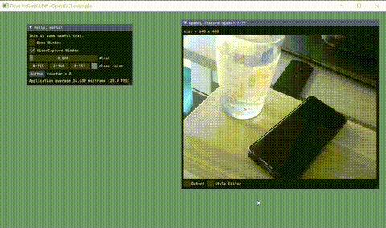

环境准备：

- 需要OpenCV，请在CMakeLists.txt中指定自己的OpenCV的路径，并把OpenCV的dll所在路径添加至Path环境变量。
- 可能需要OpenGL32.Lib，不一定，报错时，在电脑上搜索一下，一般电脑上有，没有的话可能要下载“Windows Kits”，里面有。

编译：使用的是MSVC环境

```bash
mkdir build && cd build          # 注意要使用vs自带的环境终端去初始化msvc的环境
cmake -G "NMake Makefiles" ..
nmake
```

注：最终要把需要的dll库、资源文件复制过来就能运行，资源都放在了阿里云盘上。

---

使用：

- 直接双击exe，默认启用本地摄像头
- 或命令行执行：main.exe "视频绝对路径/rtsp地址"
  如：`main.exe "C:\\Users\\Administrator\\Videos\\demo.mp4"` 

效果：



