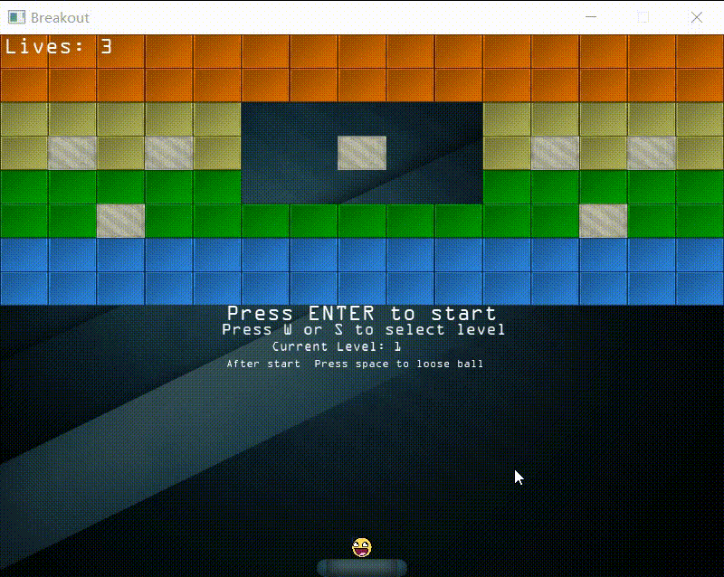

编译：使用的是MSVC环境 （一定注意，路径中绝对不能出现中文，否则在cmake检查cl.exe是都会直接报错，提示.../cl.exe -- broken）

```bash
mkdir build && cd build
cmake -G "NMake Makefiles" ..
nmake
nmake install  # 这执行完后，在build文件夹里会有一个install文件夹，里面有所有的运行程序和资源，可直接双击运行。
```

注：在阿里云盘上有build文件夹，里面的install文件夹以及install.zip都是编译过后的，没有vs环境的话，尝试直接里面拿来玩就好了。

---

游戏效果：


